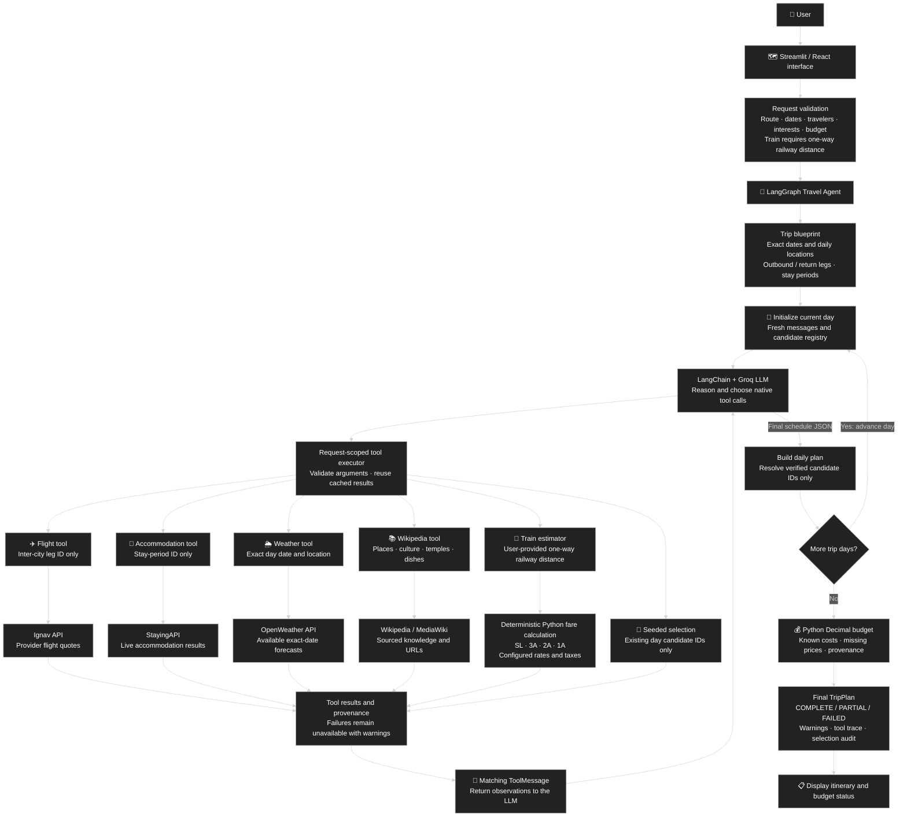

# Travel Planner — VoyageAI

An agentic travel planner in the existing Python project. LangGraph progresses through each trip day; a LangChain/Groq LLM chooses tools, reads observations, and schedules sourced attractions and dishes.

## Run

From the project root in PowerShell:

```powershell
python -m venv .venv
.\.venv\Scripts\Activate.ps1
python -m pip install -r requirements.txt
```

Configure `.env` using [.env.example](.env.example). Preserve an existing `.env`; copy the example only if no file exists. Start the backend:

```powershell
python api.py
```

In a second terminal, activate the same environment and start Streamlit:

```powershell
.\.venv\Scripts\Activate.ps1
python -m streamlit run app.py
```

UI: **http://localhost:8501**. Backend: **http://localhost:8080**. Interactive schema: **http://localhost:8080/docs**. The optional React UI has its own [run guide](frontend/README.md).

## Implemented behavior

- Native **LLM → tool call → provider/Python function → ToolMessage → LLM** flow; the model chooses tool order.
- Exact day/date/location propagation. Trip dates are inclusive; stay nights exclude checkout day.
- Only outward and return inter-city transport legs, cached by ID. Local airport transfers, sightseeing transport and local mobility costs are excluded.
- Accommodation searches by consecutive stay period, cached by ID.
- Wikipedia supplies sourced places, history, temples and dishes; it does not provide meal prices or live opening hours.
- OpenWeather supplies exact-date forecasts where available; Ignav supplies flight quotes.
- Train requires a **positive one-way railway distance**. Python uses it for each outward/return leg and shows four configured class estimates.
- Selection seed samples existing candidate IDs only; it never randomizes facts, weather, prices or hotels.
- Failures produce unavailable results and warnings. No dynamic replanning is implemented.

## Agentic architecture diagram



The LLM chooses tools and reads their ToolMessages before producing each day schedule. Tool branches are available choices, not a fixed execution sequence. Only the tool-observation loop and forward day progression repeat; there is no dynamic replanning.

## Documentation

| Guide | Contents |
| --- | --- |
| [Architecture and UML](docs/architecture.md) | Visual architecture overview, state/sequence/class diagrams and tool execution |
| [Configuration](docs/configuration.md) | Keys, train rates, limits and troubleshooting |
| [API contract](docs/api.md) | Fields, examples, validation and statuses |
| [Cleanup record](docs/cleanup.md) | Removed files and preserved reference |

## Verification

```powershell
python -m pytest -q
```

The deterministic suite has **33 passing tests** covering ToolMessages, dates/locations, caching, invalid arguments, sourced candidates, seeded selection, provider failures, budget provenance, quota handling and required train-distance input. A Train end-to-end test uses hypothetical 600 km; this is not a real route-distance claim.

Live integration is opt-in and consumes model/provider quota:

```powershell
$env:RUN_LIVE_TESTS = "1"
python -m pytest -q -m integration
```

Run `python example_trip.py` for a production graph example. It writes `output/example_trip.json` and reports missing data honestly. Keys, quota and forecasts determine completeness.

## Data limits

Python sums known INR costs with `Decimal`. Missing meal/activity prices remain unavailable, so the budget usually represents only a subtotal. Foreign-currency quotes are not converted with invented rates. Only the selected train class contributes to each leg budget; alternatives are never summed.

API `status: success` means execution completed, not that all providers succeeded. Inspect `metadata.planning_status`, `warnings` and `budget.complete`. FAILED/PARTIAL plans are explicit; absent prices are not presented as a free trip.

Live checks on **4 October 2026** confirmed working Ignav and OpenWeather keys. Weather for 11 October was outside the five-day window. The Stay key was sandbox and needs replacement for real accommodation. Saved responses are diagnostic snapshots, not production fallback facts.

## Project layout

```text
api.py                      FastAPI entry point
app.py                      Streamlit entry point
graph.py                    LangGraph and LLM/tool loop
schemas/travel.py           Request/response models
services/                   Ignav, OpenWeather, Stay, Wikipedia
tools/estimators.py          Train arithmetic and distance utilities
config/transport_rates.json Train rates and taxes
utils/budget.py             Budget arithmetic
ui/                         Streamlit components
frontend/                   Optional React/Vite UI
tests/                      Deterministic and opt-in live tests
docs/                       Architecture, configuration and API guides
output/                     Generated examples and diagnostics
```

Credentials, caches, dependencies, builds and diagnostics are excluded from Git. Keep keys in the backend `.env`.
