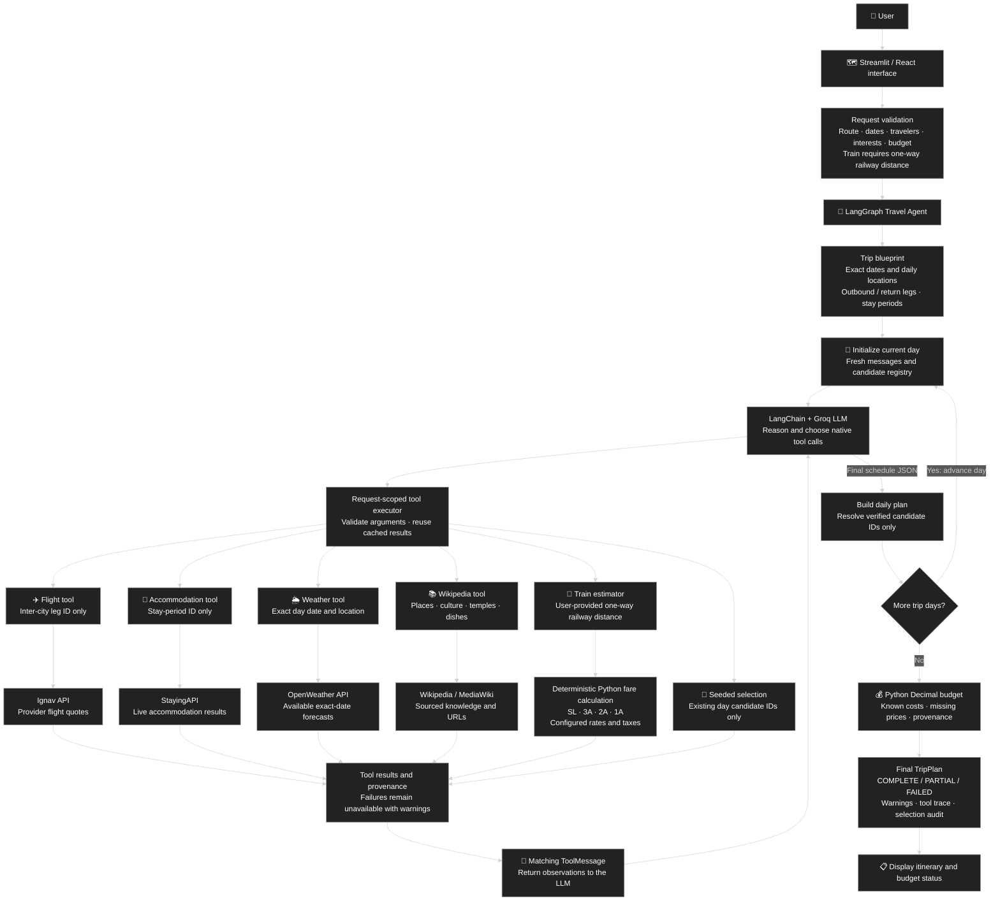
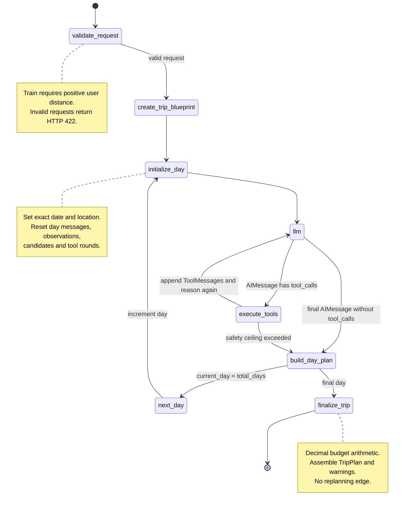
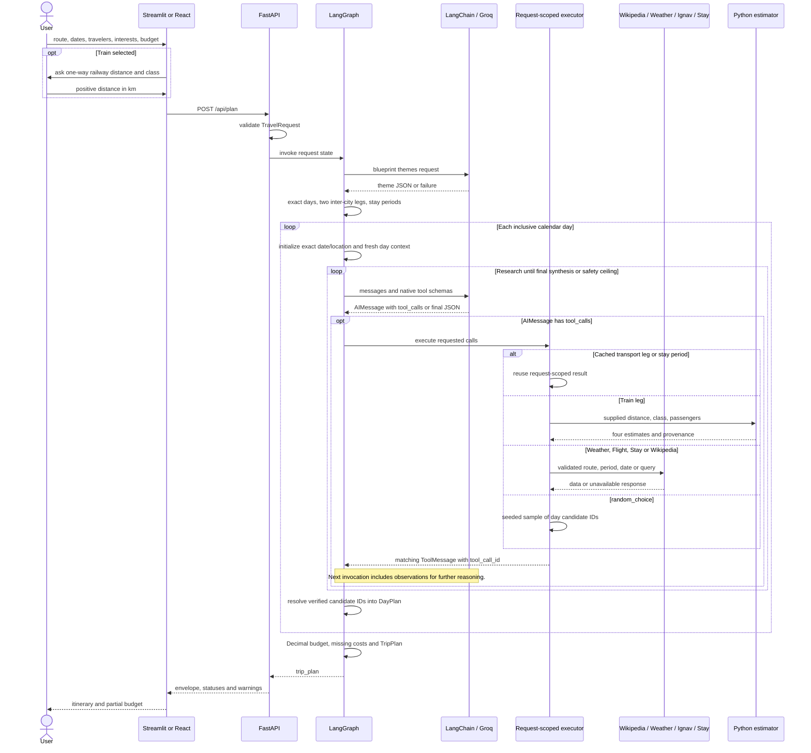
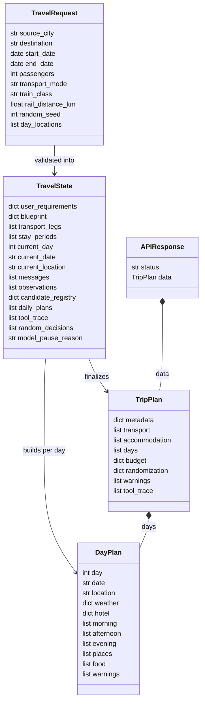

# Architecture and agentic workflow

These diagrams describe the implemented functions in `graph.py`. Mermaid renders in compatible Markdown viewers. The UML state, sequence and class diagrams remain editable as text.

## Architecture overview

This overview uses the reference's top-to-bottom layout, rectangular boxes, curved connections and a decision diamond. Tool branches represent available choices, not a mandatory sequence. The LLM decides which tools to call.

Only the tool-observation loop and forward day progression loop return to earlier nodes. There is no budget-driven replanning, Bus estimator or local mobility costing.

## LangGraph state diagram

The blueprint LLM supplies themes only. Python establishes inclusive dates, requested day locations, outward/return legs and consecutive stay periods. Blueprint model failure leaves a requested-date skeleton; it does not invent a replacement schedule.

`MAX_TOOL_ROUNDS = 8` is a safety ceiling. At the ceiling the model is asked for final structured output without new tools. An executor guard prevents further research if the model still emits tool calls. It does not impose a fixed tool order.

## LLM/tool sequence diagram

LangChain exposes native tool schemas. The executor dispatches model-requested calls and validates arguments; it does not choose a research sequence. Provider failures also become ToolMessages. Unsearched legs/stays are explicitly unavailable at finalization.

## Class and state diagram

`TravelState` is a TypedDict; request/response types are Pydantic models. The diagram lists principal fields. `schemas/travel.py` and `graph.py` provide the full contracts.

## State ownership and factual boundaries

| Scope | State and behavior |
| --- | --- |
| Entire trip | Request, blueprint, leg/stay results, completed days, trace, warnings retained during forward progression |
| Current day | Date/location, messages, observations, candidates and tool rounds initialized afresh |
| Transport | Only outward/return leg IDs; repeat lookup reuses cached result |
| Accommodation | Consecutive nights grouped; checkout excluded; cache by stay ID |
| Random selection | Seed and decision counter select existing day candidate IDs |

Weather arguments must equal the current date/location. Transport and stay calls accept only blueprint IDs. Wikipedia results receive day-scoped IDs. Final schedule JSON can reference only those IDs; invented references are discarded.

Normal Train requests use user distance, marked `USER_PROVIDED`. Python estimates are marked `CONFIGURED_ESTIMATE`. Flight/hotel costs retain provider provenance. Food/activity prices are unavailable; local mobility is excluded.

Daily Groq quota exhaustion sets `model_pause_reason`, stopping further model calls for this request. Transient limits permit bounded retries of the same invocation. Neither behavior restarts completed days or replans the trip.

## Implementation map

| Component | Implementation |
| --- | --- |
| Graph nodes and edges | `graph.py` |
| API/validation | `api.py`, `schemas/travel.py` |
| Tool schemas/dispatch | `graph.py`: `TOOLS`, `execute_tools_node` |
| Flights | `services/flight_service.py`, `services/ignav_service.py` |
| Weather | `services/weather_service.py` |
| Accommodation | `services/hotel_service.py` |
| Places/dishes | `services/wikipedia_service.py` |
| Train arithmetic | `tools/estimators.py`, `config/transport_rates.json` |
| Budget | `utils/budget.py` |

Hotel type is passed into the service but currently does not enforce a star-category filter. Fare selection uses the lowest eligible INR flight quote, lowest eligible INR hotel total, or the user's train class. Preferences do not guarantee matching provider inventory.
